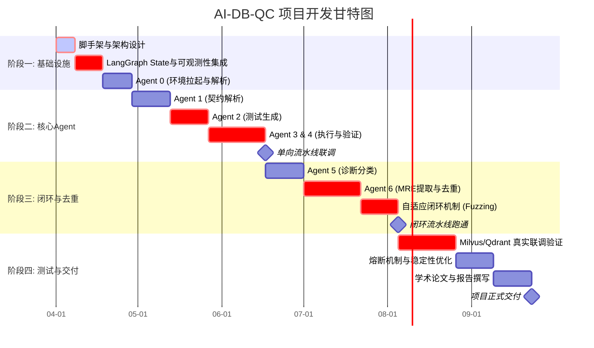

# AI-DB-QC 多智能体测试框架开发计划 (Development Plan)

**文档状态**：Draft
**计划周期**：6个月（24周）
**项目目标**：实现一个适配AI数据库（重点为向量数据库）的、基于LLM增强和契约驱动的 Multi-Agent 质量保障自动化流水线。

---

## 1. 需求分析与项目范围

### 1.1 核心需求
根据《开题报告》与《AI-DB-QC理论框架报告》，项目旨在解决向量数据库在语义校验、高维向量处理及边缘缺陷诊断方面的难题。核心需求包括：
* **全自动化闭环**：实现从“接收目标数据库版本”到“生成有效 GitHub Issue”的端到端自动化。
* **智能测试生成**：结合规则（Rule）与大模型（LLM），基于契约生成覆盖传统边界与语义边界的测试用例。
* **分层验证与诊断**：实现双层有效性模型（抽象合法性、运行时就绪性），四型缺陷分类决策树，以及包含语义预言机的双层结果验证。
* **缺陷去重与验证**：自动验证Bug可复现性，提取最小复现代码 (MRE)，并防止重复报告。

### 1.2 范围外 (Out of Scope)
* 向量数据库本身的内核级修复。
* 超过 1TB 级超大规模数据集的极限性能压测（本框架重点在于质量和语义功能的保障，非极致压测）。

---

## 2. 技术选型与架构

| 模块 | 技术栈选择 | 选型理由 |
| :--- | :--- | :--- |
| **Agent 编排框架** | **LangGraph** | 提供原生状态机(State Graph)控制，支持循环(Loop)、断点续跑(Checkpoint)与多分支路由，最适合本项目的自适应测试环。 |
| **LLM 接口** | **LangChain Core + OpenAI / Anthropic** | 生态丰富，支持 `with_structured_output` 强制 JSON 输出，确保Agent间通讯稳定。 |
| **可观测性与审计** | **LangSmith** | 与 LangChain 深度绑定，提供 Trace 追踪、Token消耗统计与耗时分析。 |
| **沙箱与执行环境** | **Docker + docker-py** | 实现Agent执行测试脚本的资源隔离，避免恶意/死循环代码拖垮宿主机。 |
| **向量数据库驱动** | `pymilvus`, `qdrant-client` | 官方原生 SDK，覆盖目标测试数据库群。 |

---

## 3. 任务拆解与 WBS (Work Breakdown Structure)

计划分为四大开发阶段，总计6个月周期。

### 阶段一：基础设施与状态机搭建 (第1-4周)
* **WBS 1.1**：项目脚手架搭建与环境配置（Python 3.11, 依赖管理）。
* **WBS 1.2**：定义 LangGraph 的全局 `State Schema`（契约数据结构、测试用例结构、缺陷报告结构）。
* **WBS 1.3**：集成 LangSmith 可观测性与 SQLite 状态持久化机制。
* **WBS 1.4**：实现 Agent 0 (环境与情报获取者) 的文档检索与 Docker 容器拉起逻辑。

### 阶段二：核心 Agent 开发与单向贯通 (第5-12周)
* **WBS 2.1**：实现 Agent 1 (场景与契约分析师) - 文档到 L1-L3 契约的转换。
* **WBS 2.2**：实现 Agent 2 (混合测试生成器) - 规则与语义 LLM 测试用例生成。
* **WBS 2.3**：实现 Agent 3 (执行与前置门控官) - 沙箱内代码执行、双层有效性拦截。
* **WBS 2.4**：实现 Agent 4 (预言机协调官) - 传统一致性预言机与 LLM 语义预言机打分逻辑。

### 阶段三：诊断、去重与闭环迭代构建 (第13-18周)
* **WBS 3.1**：实现 Agent 5 (缺陷诊断收集器) - 依据四型决策树进行Bug分类。
* **WBS 3.2**：实现 Agent 6 (缺陷验证与去重专家) - 沙箱环境重放测试，提取最小复现代码 (MRE)。
* **WBS 3.3**：实现历史Bug向量化比对去重机制。
* **WBS 3.4**：打通 LangGraph 的 Conditional Edges，实现 `Agent 5 -> Agent 2` 的 Fuzzing 优化闭环。

### 阶段四：集成测试、调优与输出 (第19-24周)
* **WBS 4.1**：选取 Milvus v2.6.x 与 Qdrant v1.17.x 进行端到端真实联调。
* **WBS 4.2**：Token 消耗控制与熔断机制（Circuit Breaker）开发。
* **WBS 4.3**：撰写《缺陷分析与自动化测试方法技术报告》及学术论文整理。

---

## 4. 里程碑与甘特图 (包含关键路径)

**关键路径分析**：
`架构设计` -> `LangGraph集成` -> `Agent 2 测试生成` -> `Agent 3&4 执行与预言机` -> `Agent 6 MRE提取` -> `Fuzzing 闭环打通` -> `真实数据库联调`
（注：Agent 的质量和 MRE 的准确提取是整个系统的核心难点，必须预留充足时间。）

---

## 5. 交付物清单 (Deliverables)

1. **AI-DB-QC 源代码仓库**（包含7个Agent的完整实现、LangGraph流程定义）。
2. **多环境部署脚本** (`docker-compose.yml` 及 Agent 0 使用的模板配置)。
3. **架构与运维文档**：系统的部署指南与操作手册。
4. **测试资产包**：针对至少2个向量数据库（如 Milvus, Qdrant）生成的基准测试用例集。
5. **缺陷报告集**：框架自动挖掘出并验证通过的 `GitHub Issue Markdown` 集合。
6. **技术报告/学术论文**：1篇关于 AI数据库质量保障技术的技术研究报告。

---

## 6. 测试验收与质量门禁标准 (Quality Gates)

| 阶段 | 门禁指标 (KPIs) | 验证方式 |
| :--- | :--- | :--- |
| **代码级门禁** | 测试覆盖率 > 80%，Pylint/Flake8 无严重警告。 | CI/CD 自动化检测 (GitHub Actions) |
| **Agent 输出** | 结构化输出(JSON)格式符合率 100%。 | Pydantic Validator 校验，自动重试记录 < 5% |
| **测试执行** | Docker 沙箱隔离率 100%，无宿主机崩溃记录。 | 长时间 (48小时) 混沌测试 |
| **业务验收** | 生成的 Bug Issue 可复现率 (MRE有效率) > 90%。 | 人工抽样重放测试验证 |
| **系统健壮性** | 支持断网、OOM时的状态恢复，断点续跑成功率 100%。 | 拔线模拟与进程 Kill 演练 |

---

## 7. 上线运维与基础设施保障 (Deployment & Ops)

* **隔离策略**：要求运行流水线的宿主机配置 Docker 环境。Agent 代码沙箱设置硬限制（如 `cpus=1.0`, `mem_limit=512m`）。
* **审计追踪**：要求运维人员配置 `LANGCHAIN_API_KEY`，每次运行的 Trace 可在 LangSmith 后台全程追溯。
* **预算熔断**：配置环境变量 `MAX_TOKEN_BUDGET=10.0` (USD) 与 `MAX_LOOP_ITERATIONS=50`，到达阈值自动执行安全下线并保存状态快照。
* **资产归档**：在本地生成的 `.trae/runs/` 目录下，按 `run_id` 归档所有的日志、生成的代码及配置文件，支持事后审查。

---

## 8. 评审节点与沟通机制

### 8.1 评审节点 (Review Nodes)
* **R1：架构设计评审 (第2周末)**：确认 LangGraph Schema 设计、Agent 边界与数据流转协议。
* **R2：单向连通评审 (第12周末)**：演示系统能够从文档解析一路执行到缺陷诊断（不含循环与去重）。
* **R3：闭环有效性评审 (第18周末)**：演示 Agent 5 反馈驱动 Agent 2 进行缺陷变异，及 Agent 6 的 MRE 提取能力。
* **R4：最终验收评审 (第24周末)**：审核挖掘出的真实 Bug Issue 及相关学术报告。

### 8.2 沟通机制
* **周会 (Weekly Sync)**：每周五对齐甘特图进度，同步当前遇到的技术阻塞（如 LLM 幻觉、Docker网络连通性等）。
* **异步协同**：使用代码仓库的 Issue / PR 追踪细粒度任务，所有架构变动必须提交 ADR (Architecture Decision Record) 文档。
* **异常通报**：若发生 LLM API 账单异常飙升或沙箱逃逸等严重安全事件，触发紧急群聊通报机制。