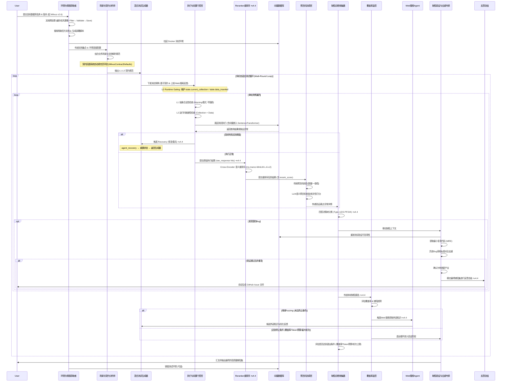

# AI-DB-QC 多智能体 (Multi-Agent) 工作流设计方案

> **文档版本**: v4.4 | 本文档反映 AI-DB-QC v4.4 架构，包含 L2 运行时门控、四型缺陷分类决策树、文档预处理流水线、契约回退系统与 Reranker 智能体等核心特性。

本文档基于 `开题报告.txt` 与 `AI-DB-QC_理论框架报告_v2.md`，通过多智能体 (Multi-Agent) 架构对项目进行落地设计。旨在将理论框架中的契约驱动、双层有效性模型、LLM语义生成、语义预言机与四型分类法转化为可自动化运行的多Agent协作系统。

---

## 1. 架构总览

AI-DB-QC 工作流被设计为由 **9个核心 Agent** 组成的流水线（Pipeline）。通过引入 Multi-Agent 机制，能够让系统在"环境拉起与文档检索 - 需求解析 - 测试生成 - 执行拦截与L2门控 - 结果重排序 - 语义验证 - 缺陷诊断 - 缺陷验证与去重"的各个环节中发挥 LLM 的自主分析与推理能力。

核心工作流（多轮闭环迭代）：
`环境与情报获取 Agent` ➡️ `场景分析 Agent` ➡️ `测试生成 Agent` ➡️ `执行与前置门控 Agent (含L2运行时门控)` ➡️ **`Reranker 重排序 Agent`** ➡️ `预言机协调 Agent` ➡️ `缺陷诊断 Agent (四型决策树)` ➡️ `覆盖率监控` ➡️ **(反馈优化/Web搜索)** ➡️ `测试生成 Agent`
在发现潜在缺陷后，触发**旁路验证流**：
`缺陷诊断 Agent` ➡️ `缺陷验证与去重 Agent` ➡️ `反思总结` ➡️ `GitHub Issue 生成`

**v4.4 新增核心能力**：
- **L2 运行时门控 (L2 Runtime Gating)**: Agent3 维护 `state.current_collection` 与 `state.data_inserted` 状态字段，实现双层有效性模型中的 L2 就绪性检查
- **Reranker 智能体**: 基于 Cross-Encoder (`cross-encoder/ms-marco-MiniLM-L-6-v2`) 对执行结果进行语义重排序，位于 Agent3 与 Agent4 之间
- **四型缺陷分类决策树**: Agent5 使用 Type-1/Type-2/Type-2.PF/Type-3/Type-4 五类分类体系
- **契约回退系统 (Contract Fallback)**: `MilvusContractDefaults` 自动填充 LLM 提取失败的空契约字段
- **文档预处理流水线**: 缓存优先策略 (Cache-First)，支持本地 JSONL 缓存、过滤、验证、保存管线

---

## 2. 智能体角色定义与职责 (Agents Roles)

### 2.0 环境与情报获取者 (Environment & Reconnaissance Agent)
* **核心职责**：作为流水线的入口点，接收用户极简输入（如 "Milvus v2.6.12"）。负责自主搜索、爬取并解析目标数据库该版本的官方文档（包括API结构、配置参数）；同时编写并执行部署脚本（如 Docker Compose），拉起目标数据库的测试环境。**采用深度爬取策略，使用 Crawl4AI 实现最多 3 层的递归爬取，智能过滤链接（同域名、排除静态资源、外部链接、锚点），并提供实时爬取进度监控，确保文档覆盖的完整性。**
* **输入**：用户指定的数据库名称与版本号
* **输出**：目标数据库完整文档集合（Markdown/JSON）、环境连接配置（Endpoints, Ports, Credentials）、爬取统计信息
* **LLM核心能力/工具**：网络搜索 (Web Search)、Crawl4AI 深度爬虫（BFSDeepCrawlStrategy）、智能链接过滤、URL 去重、爬取进度监控、Shell/Docker 脚本生成与执行能力。

### 2.1 场景与契约分析师 (Scenario & Contract Analyst Agent)
* **核心职责**：负责从项目说明文档或实际应用场景（如金融风控、电商推荐）中提取测试场景，并转化为三层契约（L3应用契约、L2语义契约、L1API契约）。
* **对应理论模块**：场景理解模块 (7.1)、三层契约系统 (6.1)
* **输入**：业务需求文档、向量数据库API文档
* **输出**：结构化的测试契约 (Contracts JSON/YAML)
* **LLM核心能力**：信息抽取、业务意图理解、规则形式化。

### 2.2 混合测试生成器 (Hybrid Test Generation Agent)
* **核心职责**：根据上游提供的三层契约，生成高维、语义相关的测试用例，覆盖传统边界测试以及新型语义测试（语义等价、语义边界、对抗样本）。**在多轮循环中，它还会接收缺陷诊断 Agent 传回的薄弱点反馈，针对性地进行用例变异与对抗样本进化。**
* **对应理论模块**：LLM增强测试生成 (7.2)、混合生成策略 (7.3)
* **输入**：结构化的测试契约、**上一轮的缺陷特征与反馈（Feedback）**
* **输出**：多维测试用例集（规则用例 + LLM语义用例）
* **LLM核心能力**：语义发散（同义词、模糊查询、对抗噪音）、场景构造、**基于反馈的缺陷寻优（Fuzzing）**。

### 2.3 执行与前置门控官 (Execution & Gating Agent)
* **核心职责**：负责与目标向量数据库（如Milvus, Qdrant）进行交互并执行测试，同时严格把控**双层有效性模型**，拦截非法或未就绪的请求。
* **对应理论模块**：双层有效性模型 (4.1)
* **输入**：测试用例集
* **输出**：L1合法性校验结果、L2就绪性校验结果、数据库原始执行结果/错误码
* **系统交互能力**：代码执行、状态机维护、适配器调用。

#### v4.4 新增: L2 运行时门控 (L2 Runtime Gating)

Agent3 在 v4.4 中引入了**双层门控机制**，不仅进行静态的 L1 契约校验，还增加了动态的 L2 运行时就绪性检查：

**L1 抽象合法性门控 (Abstract Legality Check)**:
- 检查 `dimension` 是否在 `allowed_dimensions` 范围内（**v4.4 变更**: 维度不匹配不再阻断执行，而是记录 `l1_warning` 作为潜在 Type-1 缺陷信号）
- 检查 `metric_type` 是否在 `supported_metrics` 列表中
- 检查 `top_k` 是否超过 `max_top_k` 限制
- 所有违规项均以 **Warning** 形式记录，允许"潜在非法请求"继续执行，以便捕获**Type-1 (Illegal Success)** 类缺陷

**L2 运行时就绪性门控 (Runtime Readiness Check)**:
- 检查 `state.current_collection` 是否存在活跃 Collection
- 检查 `state.data_inserted` 是否为 `True`（数据是否已注入）
- 检查 Index 是否已加载（如需要）
- Agent3 在执行过程中负责维护这两个 WorkflowState 字段：
  - `state.current_collection`: 当前活跃的 Collection 名称（由 Adapter 创建并同步）
  - `state.data_inserted`: 数据注入完成标志（GT 数据 + 噪声数据嵌入后设为 True）

**L2 门控对决策树的关键作用**:
L2 就绪性检查的结果直接影响 Agent5 的**四型缺陷分类决策树**中 **Type-2 vs Type-2.PF** 的区分：
- 当 `L1=PASS | Exec=FAIL | L2=PASS` → **Type-2** (Poor Diagnostics): 运行时状态良好但执行失败，诊断信息不足
- 当 `L1=PASS | Exec=FAIL | L2=FAIL` → **Type-2.PF** (Precondition Failure): 运行前条件未满足导致失败

**自适应契约演化 (Adaptive Contract Evolution)**:
当执行遇到异常错误时，Agent3 会调用 `refine_contract_from_error()` 自动从错误信息中提取新约束规则，热修补 L1 契约 (`state.contracts.l1_api.update()`)，实现契约的在线学习。

### 2.3.5 结果重排序智能体 (Reranker Agent) ⭐ v4.4 新增
* **核心职责**：位于 Agent3 (执行门控) 与 Agent4 (预言机协调) 之间，对数据库返回的 Top-K 搜索结果使用 Cross-Encoder 模型进行**语义重排序**，为下游预言机提供更准确的排序依据。
* **模型**：`cross-encoder/ms-marco-MiniLM-L-6-v2`（SentenceTransformers CrossEncoder）
* **输入**：Agent3 的 `ExecutionResult`（含原始 `raw_response` hits 列表）
* **输出**：重排序后的 `ExecutionResult`（每个 hit 增加 `rerank_score` 字段，按分数降序排列）
* **工作流程**：
  1. 从每个 ExecutionResult 的 `raw_response` 中提取 hits 列表
  2. 构造 `(query_text, hit_payload.text)` 查询-文档对
  3. 调用 CrossEncoder.predict() 计算语义相关性得分
  4. 将 `rerank_score` 写入每个 hit，并按分数降序重排
* **容错机制**：若 CrossEncoder 模型加载失败，自动降级为**词重叠 (Word Overlap)** 评分策略
* **LLM核心能力/工具**：Cross-Encoder 语义相似度计算、异步并发重排序

### 2.4 预言机协调官 (Oracle Coordinator Agent)
* **核心职责**：作为智能预言机系统，对执行结果的正确性进行分层验证。先使用传统预言机检查单调性/一致性，再调用LLM进行深度的语义验证（相关性、完整性、排序）。
* **对应理论模块**：智能预言机系统 (8.1, 8.2)、语义异常检测
* **输入**：原始测试用例、执行结果、上下文意图
* **输出**：验证结果（通过/失败）、异常类型及解释 (Explanation)
* **LLM核心能力**：语义相关性打分、意图比对、逻辑推理。

### 2.5 缺陷诊断与证据链收集器 (Defect Diagnoser & Reporter Agent)
* **核心职责**：根据前置门控和预言机的结果，使用**四型缺陷分类决策树 (Four-Type Decision Tree)**将缺陷分类，并组装三级证据链。同时，评估当前测试的覆盖率与缺陷趋势，提取易错边界特征生成优化反馈 (Feedback) 回传给测试生成器；判断是否达到循环终止条件。**当确认发现潜在Bug时，将缺陷上下文移交给缺陷验证与去重 Agent。**
* **对应理论模块**：四型缺陷分类法 (5.1)、三级证据链 (10.2)
* **输入**：执行状态（成功/失败/异常）、L1/L2校验结果、预言机验证结果
* **输出**：格式化的初步缺陷报告、下一轮自适应测试反馈
* **LLM核心能力**：决策树遍历、证据综合、缺陷特征归纳与循环调度。

#### v4.4 核心: 四型缺陷分类决策树 (Four-Type Classification Decision Tree)

Agent5 的 `classify_defect_v2()` 方法实现了基于理论框架的**五类缺陷分类体系**。决策树以 L1 契约合法性、执行结果、L2 运行时就绪性、预言机验证结果为判定节点：

```
                        L1: 契约合法?
                             |
               ┌─────────────┴─────────────┐
              NO (有Warning)               YES (无Warning)
               |                            |
             执行成功?                    执行成功?
           ┌──┴──┐                      ┌───┴───┐
          YES   NO                     NO     YES
           |     |                      |       |
        Type-1 Type-2              L2通过?  L2通过?
                                      |       |
                                    NO       YES
                                     |        |
                                  Type-2.PF  Oracle通过?
                                             |
                                           NO     YES
                                            |       |
                                         Type-4  无缺陷(Type-3保留)
```

**五种缺陷类型详解**:

| 类型 | 名称 | 判定条件 | 证据级别 | 根因分析 |
|------|------|----------|----------|----------|
| **Type-1** | 非法成功 (Illegal Success) | `L1=FAIL \| Exec=SUCCESS` | L1 | 非法请求绕过了契约校验并被数据库成功执行（契约被绕过） |
| **Type-2** | 诊断不足 (Poor Diagnostics) | `L1=FAIL \| Exec=FAIL` 或 `L1=PASS \| Exec=FAIL \| L2=PASS` | L2 | 请求失败但错误信息模糊/不充分；或运行时状态良好却意外失败 |
| **Type-2.PF** | 前置条件失败 (Precondition Failure) | `L1=PASS \| Exec=FAIL \| L2=FAIL` | L2 | 运行前条件未满足（Collection不存在/无数据）导致执行失败 |
| **Type-3** | 传统预言机违规 (Traditional Oracle) | `L1=PASS \| Exec=SUCCESS \| 传统预言机=FAIL` | L2/L3 | 通过了所有门控和执行，但传统预言机（单调性/一致性）检测到异常 |
| **Type-4** | 语义违规 (Semantic Violation) | `L1=PASS \| Exec=SUCCESS \| Oracle(语义)=FAIL` | L3 | 执行成功且传统检查通过，但LLM语义预言机判定结果语义不符 |

**关键设计要点**:
- **Type-2 vs Type-2.PF 的区分**: 完全依赖 Agent3 的 L2 Runtime Gating 结果 (`state.data_inserted` + `state.current_collection`)
- **Type-1 的捕获机制**: v4.4 中 L1 门控改为 Warning 模式，允许"潜在非法请求"继续执行，从而能检测到"非法请求竟然成功"的 Type-1 缺陷
- **证据链增强**: Type-2 / Type-2.PF / Type-3 类缺陷会自动触发 Docker 深度日志抓取 (`DockerLogsProbe.fetch_recent_logs(tail=100)`) 作为补充证据
- **知识库写入**: 每个确认的缺陷会同步写入 `DefectKnowledgeBase` 作为历史记录

**反馈生成策略**:
- 有缺陷时: `"Case {id} failed with {type}: {root_cause[:100]}"` → 指导 Agent2 对薄弱点进行变异
- 无缺陷时: 尝试更激进的对抗语义查询

### 2.6 缺陷验证与去重专家 (Defect Verifier & Deduplicator Agent)
* **核心职责**：对诊断出的潜在Bug进行严格的"二验"机制。首先尝试独立重放测试以验证**可复现性**，提取并精简出**最小复现代码 (Minimal Reproducible Example, MRE)**；检查证据链（日志、配置、执行结果）是否齐全；然后查询本地的历史Bug知识库或项目的现有Issue库进行**多维度相似度去重**（语义相似度 0.5 + 结构相似度 0.3 + 行为相似度 0.1 + 上下文相似度 0.1）；使用证据验证器检查证据链的完整性和可信度，计算证据参考相似度阈值（默认 0.6）以确保证据质量；所有条件满足后，自动生成标准化的 GitHub Issue Markdown 文件。
* **输入**：初步缺陷报告、完整执行上下文（请求、响应、日志）、历史Bug知识库
* **输出**：验证通过的新 Bug 列表、标准化的 `GitHub_Issue_xxx.md` 文件、去重统计报告、证据验证结果
* **LLM核心能力/工具**：代码精简与重构（提取MRE）、环境状态重置与验证执行、基于 SentenceTransformer 的多维度文本相似度检索（Bug去重）、ChromaDB 向量数据库与混合搜索、证据链验证与可信度评估、Markdown报告生成。

---

## 2.7 文档预处理流水线 (Document Preprocessing Pipeline) ⭐ v4.4 新增

### 概述

v4.4 引入了**缓存优先 (Cache-First)** 的文档预处理策略，解决每次运行都需重新爬取文档的性能瓶颈。文档预处理在 Agent0（环境与情报获取）阶段执行，为下游 Agent1（契约分析）提供结构化的文档输入。

### 架构设计

```
文档来源选择 (DocsConfig.source)
    │
    ├── "auto" ──→ 优先检查本地JSONL缓存 ──→ 命中则直接加载
    │                  │
    │                  未命中 → 启动 Crawl4AI 爬取
    │
    ├── "local_jsonl" ──→ 仅从本地 JSONL 文件加载
    │
    └── "crawl" ──→ 强制重新爬取并覆盖缓存
```

### 处理管线: Filter → Validate → Save

**Step 1 - 过滤 (Filter)**:
- 按 `DocsConfig.allowed_versions` 过滤文档版本（如仅保留 `["2.6"]`）
- 按 `DocsConfig.min_chars` 过滤过短文档（默认 ≥500 字符）
- 排除静态资源、锚点链接等无关内容

**Step 2 - 验证 (Validate)**:
- 检查文档总数是否达到 `DocsConfig.min_docs`（默认 ≥50 篇）
- 检查是否包含 `DocsConfig.required_docs` 关键词（如 `index-explained`, `single-vector-search`, `multi-vector-search`）
- 验证结果写入 `state.docs_validation`

**Step 3 - 保存 (Save)**:
- 处理后的文档以 **JSONL 格式** 存储至本地缓存路径
- 默认路径: `.trae/cache/milvus_io_docs_depth3.jsonl`
- 支持缓存 TTL 控制 (`DocsConfig.cache_ttl_days`，默认 7 天)

### 配置参数 (DocsConfig)

| 参数 | 默认值 | 说明 |
|------|--------|------|
| `source` | `"auto"` | 文档来源: auto / local_jsonl / crawl |
| `local_jsonl_path` | `.trae/cache/...` | 本地 JSONL 缓存文件路径 |
| `cache_enabled` | `true` | 是否启用缓存 |
| `cache_ttl_days` | `7` | 缓存有效期（天） |
| `allowed_versions` | `["2.6"]` | 允许的文档版本列表 |
| `min_chars` | `500` | 单篇文档最小字符数 |
| `min_docs` | `50` | 最少文档数量要求 |
| `required_docs` | `["index-explained", ...]` | 必须包含的关键词列表 |

---

## 2.8 契约回退系统 (Contract Fallback System) ⭐ v4.4 新增

### 概述

当 Agent1（场景与契约分析师）通过 LLM 从文档中提取契约信息时，可能因文档不完整或 LLM 抽取失败导致部分字段为空。**契约回退系统**确保测试生成永远不会因缺失的契约字段而阻塞。

### 核心组件: MilvusContractDefaults

`MilvusContractDefaults` 是一个 dataclass，定义了 Milvus 数据库的完整契约默认值：

**L1 API 约束默认值**:

| 字段 | 默认值 | 说明 |
|------|--------|------|
| `allowed_dimensions` | `[4, 8, 16, ..., 32768, ...]` | 支持 30 种维度（含极端值用于压力注入） |
| `supported_metrics` | `["L2", "IP", "COSINE", "HAMMING", "JACCARD", "BM25"]` | 6种距离度量类型 |
| `max_top_k` | `16384` | Top-K 上限 |
| `supported_index_types` | `["FLAT", "IVF_FLAT", ..., "TRIE"]` | 12种索引类型 |

**L2 语义约束默认值**:

| 字段 | 默认值 | 说明 |
|------|--------|------|
| `operational_sequences` | 5种标准操作序列 | 如 `create→insert→search` 等 |

### 回退机制工作流

```
Agent1 输出契约字典 (可能有空字段)
        │
        ▼
apply_fallbacks(contract_dict, db_type="milvus")
        │
   遍历每个字段 ──→ 若值为空/None → 用 MilvusContractDefaults 填充
        │
        ▼
输出: 完整填充的契约字典 + 日志记录哪些字段被回退填充
```

### 设计原则

- **非侵入式**: 仅对空字段生效，LLM 已提取的有效值不会被覆盖
- **可扩展**: 通过 `FALLBACK_REGISTRY` 注册表支持未来添加 Qdrant 等其他数据库的回退规则
- **可审计**: 回退操作会通过 logger 记录具体填充了哪些字段，便于追踪数据质量

---

## 3. 智能体间交互流程 (Workflow Flow)

整个项目周期可以划分为以下标准协作流：



---

## 4. 数据流转与接口定义 (Data Interfaces)

为了保证Agent间通信的结构化（遵循 **Schema优先** 设计原则），推荐使用JSON/Pydantic规范接口：

1. **契约数据结构 (Contract Schema)**:
   包含 `scenario`, `semantic_expectations`, `api_constraints`。**v4.4**: 经 `MilvusContractDefaults` 回退填充后保证字段完整性。
2. **测试用例结构 (Test Case Schema)**:
   包含 `case_id`, `query_vector/text`, `dimension`, `expected_L1`, `expected_L2`, `is_adversarial`, `is_negative_test`, `expected_ground_truth`, `assigned_source_url`。
3. **执行结果结构 (Execution Result Schema)** ⭐v4.4 增强:
   包含 `case_id`, `success`, `l1_passed`, `l2_passed`, `error_message`, `raw_response` (hits列表), `execution_time_ms`, **`l1_warning`** (L1违规警告，非阻断), **`l2_result`** (`{passed, reason}` L2门控详情), **`underlying_logs`** (Docker深度日志)。
4. **验证结果结构 (Validation Result Schema)**:
   包含 `passed`, `anomalies` (如 `irrelevant_result`, `poor_ranking`), `explanation`。**v4.4**: 输入已由 Reranker 重排序，包含 `rerank_score`。
5. **缺陷报告结构 (Defect Report Schema)** ⭐v4.4 增强:
   包含 `bug_type` (**Type-1/Type-2/Type-2.PF/Type-3/Type-4**), `evidence_level` (L1/L2/L3), `root_cause_analysis`, `title`, `operation`, `error_message`, `database`, `source_url`, `mre_code`, `verification_status`, `verifier_verdict`。
6. **WorkflowState 核心字段** ⭐v4.4:
   - `current_collection`: L2 门控用活跃 Collection 名称
   - `data_inserted`: L2 门控用数据注入标志
   - `docs_validation`: 文档预处理验证结果
   - `consecutive_failures`: 连续失败计数（触发 Recovery 的条件）
   - `total_tokens_used` / `max_token_budget`: Token 熔断机制

---

## 5. 落地技术栈建议

* **框架选择**：**LangGraph**（已采用）。项目使用 `StateGraph(WorkflowState)` 构建流水线，支持条件路由 (`conditional_edges`)、检查点 (`MemorySaver`) 和节点恢复 (`agent_recovery`, `agent_reflection`)。
* **LLM模型**：在涉及 `语义预言机打分` 和 `对抗用例生成` 时，需要使用推理能力强的模型（如 GPT-4o, Claude 3.5 Sonnet 等）。配置通过 `LLMConfig` 管理（支持 Anthropic/OpenAI/智谱）。
* **数据库适配器层**：使用 Python 编写统一的 VDBMS Adapter 接口（`MilvusAdapter`），底层调用 pymilvus 官方SDK。支持异步执行 (`search_async`)、Harness 生命周期管理 (`setup_harness`/`teardown_harness`)。
* **深度爬虫引擎**：**Crawl4AI**，支持异步爬取、智能链接过滤、BFS 深度爬取策略（最多 3 层）、JavaScript 渲染、进度监控和统计。**v4.4 新增**: 爬取结果经文档预处理管线 (Filter→Validate→Save) 后缓存为本地 JSONL。
* **向量嵌入与重排序**：
  - **Bi-Encoder**: `SentenceTransformer (all-MiniLM-L6-v2)` — 用于查询向量化（Agent3）和缺陷去重相似度计算（Agent6）
  - **Cross-Encoder ⭐v4.4**: `cross-encoder/ms-marco-MiniLM-L-6-v2` — Reranker Agent 用于对 Top-K 结果进行精确语义重排序
* **向量数据库**：**ChromaDB**，用于存储缺陷知识库、文档向量，支持混合搜索（向量 + 关键词）和语义相似度检索。
* **文本嵌入模型**：**SentenceTransformer (all-MiniLM-L6-v2)**，用于多维度相似度计算（语义、结构、行为、上下文）和证据链验证。
* **配置管理**：**Pydantic Settings** + YAML (`config.yaml`) + 环境变量覆盖。核心配置类: `AppConfig > {LLMConfig, DatabaseConfig, HarnessConfig, AgentConfig, DocsConfig}`。

---

## 6. 工程化与基础设施保障 (Infrastructure & Ops)

为了确保多Agent流水线在动态环境和多轮自适应循环中能够**稳定、可审计且安全**地运行，系统必须具备以下基础设施层面的保障：

### 6.1 可审计性保障 (Auditability)
1. **全链路可观测性 (Tracing)**：集成 **LangSmith** 或 **Langfuse**。记录每个 Agent 的每一次 LLM 调用，包括：`Trace ID`、`输入 Prompt`、`原始输出`、`耗时` 和 `Token 消耗`，确保"AI的每一个决策都可复盘"。
2. **物料与资产归档 (Artifact Archiving)**：为每次测试运行分配唯一的 `Run_ID`。系统需在本地或云端结构化地归档：Docker 日志、执行错误堆栈、最小复现代码 (MRE) 及最终的 Issue 文件。
3. **状态机持久化 (Checkpointing)**：利用 LangGraph 的 Checkpoint 机制（如基于 SQLite/PostgreSQL），将每一步的图状态 (Graph State) 存盘，实现**防灾恢复与断点续跑 (Resume)**。

### 6.2 知识库与智能检索 (Knowledge Base & Intelligent Retrieval)
1. **缺陷知识库 (Defect Knowledge Base)**：基于 **ChromaDB** 构建持久化缺陷知识库，存储历史缺陷、文档向量、测试用例等。支持向量检索、关键词检索和混合搜索，提供语义相似度计算和多维度过滤。
2. **证据链验证 (Evidence Chain Validation)**：实现证据参考相似度计算，验证证据链的完整性和可信度。使用 SentenceTransformer 计算证据与缺陷的语义相似度，设置相似度阈值（默认 0.6）过滤低质量证据。
3. **增量学习与知识更新**：支持增量添加新缺陷、更新文档向量、维护去重规则库，实现知识库的持续进化和自我优化。

### 6.3 监控与遥测 (Monitoring & Telemetry)
1. **爬取进度监控 (Crawl Progress Monitoring)**：实时监控深度爬取进度，统计已爬取页面数、当前深度、失败 URL 数量等关键指标，提供可视化进度反馈。
2. **性能指标采集 (Performance Metrics Collection)**：采集各 Agent 执行时间、内存使用、Token 消耗、API 调用次数等性能指标，用于系统优化和成本控制。
3. **异常检测与告警 (Anomaly Detection & Alerting)**：基于统计方法和机器学习模型，检测爬取异常、测试执行异常、LLM 输出异常等，触发告警机制并记录异常上下文。

### 6.4 稳定性与安全保障 (Stability & Security)
1. **执行沙箱与资源隔离 (Execution Sandbox)**：Agent 执行的任何外部测试代码或 Shell 脚本，必须在**隔离的 Docker 容器**中运行，并设置严格的超时时间 (Timeout) 和内存限制 (OOM Killer)，防止宿主机崩溃。
2. **结构化输出容错与自愈 (Fallback)**：强制 LLM 使用 `JSON Mode` 或 `Structured Output`。配备重试解析机制 (Output Parser Retry)，在 LLM 输出格式错误时自动将其报错信息回传以实现自我纠正（限制重试次数）。
3. **防退化与死循环检测 (Loop Breaker)**：在自适应测试循环网关处引入**多样性校验器**（如对比生成用例的向量相似度）。若连续多轮未探索到新边界，强制重置 Prompt 或提升生成温度 (Temperature)。
4. **Token 预算与熔断机制 (Circuit Breaker)**：设置全局预算管理器。一旦达到预设的最大循环次数、或者 API Token 消耗达到阈值（如 $10），立刻触发**硬熔断**，优雅终止流水线并保存现有产出。