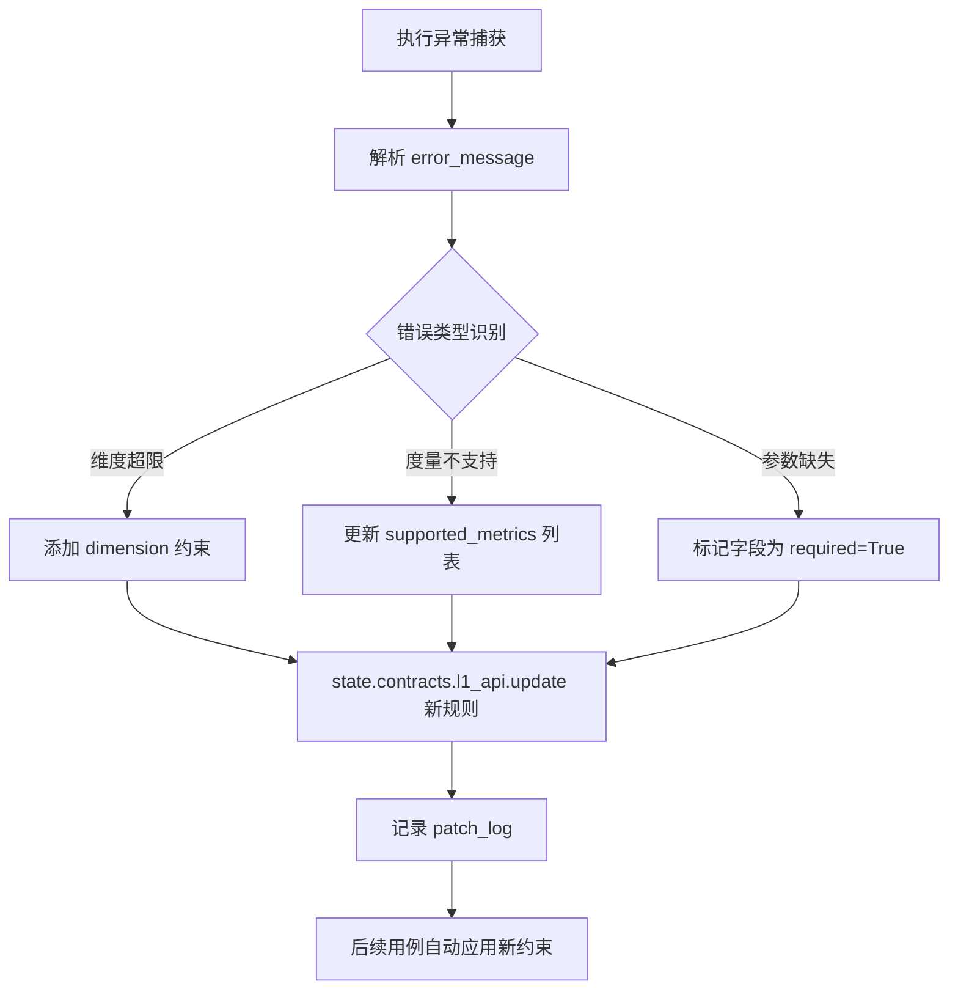
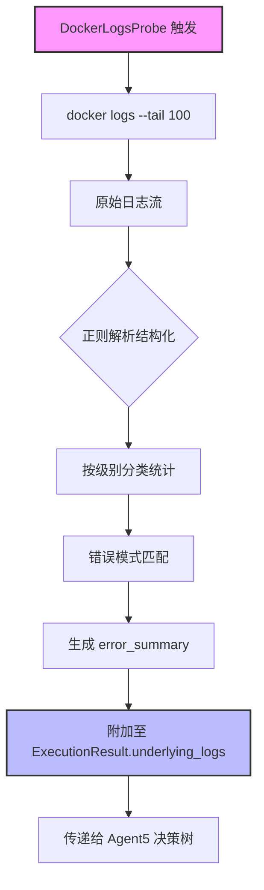
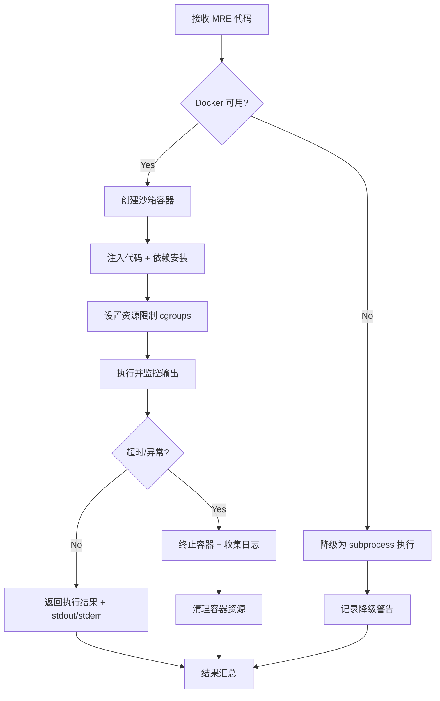
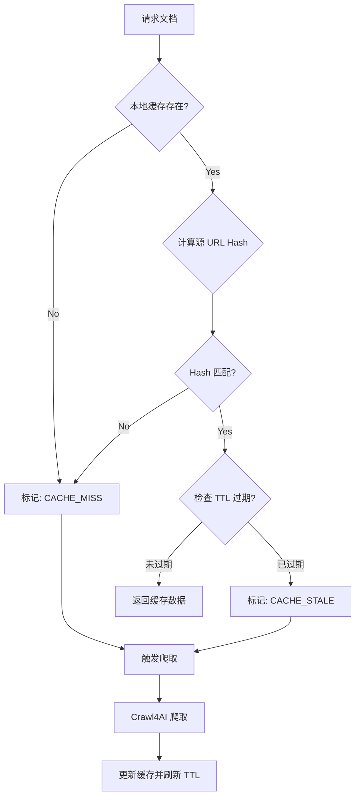
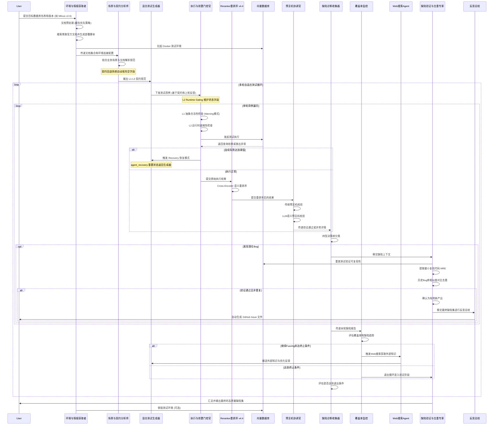

# AI-DB-QC 多智能体 (Multi-Agent) 工作流设计方案

> **文档版本**: v4.5 | 本文档反映 AI-DB-QC v4.5 架构，包含 L2 运行时门控、四型缺陷分类决策树、文档预处理流水线、契约回退系统与 Reranker 智能体等核心特性。

本文档基于 `开题报告.txt` 与 `AI-DB-QC_理论框架报告_v2.md`，通过多智能体 (Multi-Agent) 架构对项目进行落地设计。旨在将理论框架中的契约驱动、双层有效性模型、LLM语义生成、语义预言机与四型分类法转化为可自动化运行的多Agent协作系统。

---

## 1. 架构总览

AI-DB-QC 工作流被设计为由 **9个核心 Agent** 组成的流水线（Pipeline）。通过引入 Multi-Agent 机制，能够让系统在"环境拉起与文档检索 - 需求解析 - 测试生成 - 执行拦截与L2门控 - 结果重排序 - 语义验证 - 缺陷诊断 - 缺陷验证与去重"的各个环节中发挥 LLM 的自主分析与推理能力。

核心工作流（多轮闭环迭代）：
`环境与情报获取 Agent` ➡️ `场景分析 Agent` ➡️ `测试生成 Agent` ➡️ `执行与前置门控 Agent (含L2运行时门控)` ➡️ **`Reranker 重排序 Agent`** ➡️ `预言机协调 Agent` ➡️ `缺陷诊断 Agent (四型决策树)` ➡️ `覆盖率监控` ➡️ **(反馈优化/Web搜索)** ➡️ `测试生成 Agent`
在发现潜在缺陷后，触发**旁路验证流**：
`缺陷诊断 Agent` ➡️ `缺陷验证与去重 Agent` ➡️ `反思总结` ➡️ `GitHub Issue 生成`

**v4.4 新增核心能力**：
- **L2 运行时门控 (L2 Runtime Gating)**: Agent3 维护 `state.current_collection` 与 `state.data_inserted` 状态字段，实现双层有效性模型中的 L2 就绪性检查
- **Reranker 智能体**: 基于 Cross-Encoder (`cross-encoder/ms-marco-MiniLM-L-6-v2`) 对执行结果进行语义重排序，位于 Agent3 与 Agent4 之间
- **四型缺陷分类决策树**: Agent5 使用 Type-1/Type-2/Type-2.PF/Type-3/Type-4 五类分类体系
- **契约回退系统 (Contract Fallback)**: `MilvusContractDefaults` 自动填充 LLM 提取失败的空契约字段
- **文档预处理流水线**: 缓存优先策略 (Cache-First)，支持本地 JSONL 缓存、过滤、验证、保存管线

---

## 2. 智能体角色定义与职责 (Agents Roles)

### 2.0 环境与情报获取者 (Environment & Reconnaissance Agent)
* **核心职责**：作为流水线的入口点，接收用户极简输入（如 "Milvus v2.6.12"）。负责自主搜索、爬取并解析目标数据库该版本的官方文档（包括API结构、配置参数）；同时编写并执行部署脚本（如 Docker Compose），拉起目标数据库的测试环境。**采用深度爬取策略，使用 Crawl4AI 实现最多 3 层的递归爬取，智能过滤链接（同域名、排除静态资源、外部链接、锚点），并提供实时爬取进度监控，确保文档覆盖的完整性。**
* **输入**：用户指定的数据库名称与版本号
* **输出**：目标数据库完整文档集合（Markdown/JSON）、环境连接配置（Endpoints, Ports, Credentials）、爬取统计信息
* **LLM核心能力/工具**：网络搜索 (Web Search)、Crawl4AI 深度爬虫（BFSDeepCrawlStrategy）、智能链接过滤、URL 去重、爬取进度监控、Shell/Docker 脚本生成与执行能力。

### 2.1 场景与契约分析师 (Scenario & Contract Analyst Agent)
* **核心职责**：负责从项目说明文档或实际应用场景（如金融风控、电商推荐）中提取测试场景，并转化为三层契约（L3应用契约、L2语义契约、L1API契约）。
* **对应理论模块**：场景理解模块 (7.1)、三层契约系统 (6.1)
* **输入**：业务需求文档、向量数据库API文档
* **输出**：结构化的测试契约 (Contracts JSON/YAML)
* **LLM核心能力**：信息抽取、业务意图理解、规则形式化。

### 2.2 混合测试生成器 (Hybrid Test Generation Agent)
* **核心职责**：根据上游提供的三层契约，生成高维、语义相关的测试用例，覆盖传统边界测试以及新型语义测试（语义等价、语义边界、对抗样本）。**在多轮循环中，它还会接收缺陷诊断 Agent 传回的薄弱点反馈，针对性地进行用例变异与对抗样本进化。**
* **对应理论模块**：LLM增强测试生成 (7.2)、混合生成策略 (7.3)
* **输入**：结构化的测试契约、**上一轮的缺陷特征与反馈（Feedback）**
* **输出**：多维测试用例集（规则用例 + LLM语义用例）
* **LLM核心能力**：语义发散（同义词、模糊查询、对抗噪音）、场景构造、**基于反馈的缺陷寻优（Fuzzing）**。

### 2.3 执行与前置门控官 (Execution & Gating Agent)
* **核心职责**：负责与目标向量数据库（如Milvus, Qdrant）进行交互并执行测试，同时严格把控**双层有效性模型**，拦截非法或未就绪的请求。
* **对应理论模块**：双层有效性模型 (4.1)
* **输入**：测试用例集
* **输出**：L1合法性校验结果、L2就绪性校验结果、数据库原始执行结果/错误码
* **系统交互能力**：代码执行、状态机维护、适配器调用。

#### v4.4 新增: L2 运行时门控 (L2 Runtime Gating)

Agent3 在 v4.4 中引入了**双层门控机制**，不仅进行静态的 L1 契约校验，还增加了动态的 L2 运行时就绪性检查：

**L1 抽象合法性门控 (Abstract Legality Check)**:
- 检查 `dimension` 是否在 `allowed_dimensions` 范围内（**v4.4 变更**: 维度不匹配不再阻断执行，而是记录 `l1_warning` 作为潜在 Type-1 缺陷信号）
- 检查 `metric_type` 是否在 `supported_metrics` 列表中
- 检查 `top_k` 是否超过 `max_top_k` 限制
- 所有违规项均以 **Warning** 形式记录，允许"潜在非法请求"继续执行，以便捕获**Type-1 (Illegal Success)** 类缺陷

**L2 运行时就绪性门控 (Runtime Readiness Check)**:
- 检查 `state.current_collection` 是否存在活跃 Collection
- 检查 `state.data_inserted` 是否为 `True`（数据是否已注入）
- 检查 Index 是否已加载（如需要）
- Agent3 在执行过程中负责维护这两个 WorkflowState 字段：
  - `state.current_collection`: 当前活跃的 Collection 名称（由 Adapter 创建并同步）
  - `state.data_inserted`: 数据注入完成标志（GT 数据 + 噪声数据嵌入后设为 True）

**L2 门控对决策树的关键作用**:
L2 就绪性检查的结果直接影响 Agent5 的**四型缺陷分类决策树**中 **Type-2 vs Type-2.PF** 的区分：
- 当 `L1=PASS | Exec=FAIL | L2=PASS` → **Type-2** (Poor Diagnostics): 运行时状态良好但执行失败，诊断信息不足
- 当 `L1=PASS | Exec=FAIL | L2=FAIL` → **Type-2.PF** (Precondition Failure): 运行前条件未满足导致失败

**自适应契约演化 (Adaptive Contract Evolution)**:
当执行遇到异常错误时，Agent3 会调用 `refine_contract_from_error()` 自动从错误信息中提取新约束规则，热修补 L1 契约 (`state.contracts.l1_api.update()`)，实现契约的在线学习。

**热修补工作流程**:


**约束提取规则映射**:

| 错误模式 | 正则匹配 | 生成约束 |
|----------|----------|----------|
| `dimension out of range` | `dimension.*?(\d+).*?(\d+)` | `allowed_dimensions = range(min, max)` |
| `invalid metric_type` | `metric.*?['"](\w+)['"]` | `supported_metrics.append(metric)` |
| `top_k exceeds limit` | `top_k.*?(\d+)` | `max_top_k = current_value` |
| `collection not found` | `Collection.*?['"](\w+)['"]` | 标记 L2 precondition |

---

#### v4.4 新增: Docker 日志探测 (DockerLogsProbe)

**职责**: 当测试执行失败时，自动采集目标数据库容器的深度运行日志作为补充证据，辅助 Agent5 进行精确的根因分析（特别是 Type-2 / Type-2.PF 类缺陷）。

**触发条件**:
- `ExecutionResult.success == False`
- 缺陷类型为 **Type-2**, **Type-2.PF**, 或 **Type-3**
- 容器状态为 `running`

**探测参数配置**:

| 参数 | 默认值 | 说明 |
|------|--------|------|
| **tail_lines** | `100` | 获取最近 N 行日志 |
| **since_seconds** | `300` (5分钟) | 获取最近 N 秒内的日志 |
| **container_name_pattern** | `*milvus*` | 容器名称匹配模式 |
| **log_level_filter** | `[ERROR, WARN, FATAL]` | 日志级别过滤 |
| **timeout** | `10s` | 日志采集超时 |

**采集的数据结构 (ContainerLogEvidence)**:
```python
@dataclass
class ContainerLogEvidence:
    container_id: str           # 容器 ID (短格式)
    container_name: str         # 容器名称
    timestamp: datetime         # 采集时间戳
    log_entries: List[LogEntry] # 结构化日志条目列表
    error_summary: str          # 错误摘要 (LLM 提取)
    resource_usage: ResourceUsage  # CPU/内存/网络快照

@dataclass
class LogEntry:
    level: str                  # INFO/WARN/ERROR/FATAL
    message: str                # 日志内容
    source: str                 # 来源组件 (如 querynode, datanode)
    timestamp: str              # 原始时间戳
    trace_id: Optional[str]     # 追踪 ID (如有)

@dataclass
class ResourceUsage:
    cpu_percent: float          # CPU 使用率 (%)
    memory_mb: int              # 内存占用 (MB)
    network_rx_kb: int          # 网络接收 (KB)
    network_tx_kb: int          # 网络发送 (KB)
```

**日志分析流水线**:


**与 Agent5 决策树的集成**:
- **Type-2.PF 判定**: 若日志显示 `collection_not_found` 或 `segment_empty`，强化 L2=FAIL 的判定依据
- **Type-2 判定**: 若日志显示内部异常但无清晰错误码，支持"诊断不足"的分类
- **根因定位**: 通过 `source` 字段定位具体故障组件（如 `querynode`, `indexnode`, `datanode`）


### 2.3.5 结果重排序智能体 (Reranker Agent) ⭐ v4.4 新增
* **核心职责**：位于 Agent3 (执行门控) 与 Agent4 (预言机协调) 之间，对数据库返回的 Top-K 搜索结果使用 Cross-Encoder 模型进行**语义重排序**，为下游预言机提供更准确的排序依据。
* **模型**：`cross-encoder/ms-marco-MiniLM-L-6-v2`（SentenceTransformers CrossEncoder）
* **输入**：Agent3 的 `ExecutionResult`（含原始 `raw_response` hits 列表）
* **输出**：重排序后的 `ExecutionResult`（每个 hit 增加 `rerank_score` 字段，按分数降序排列）
* **工作流程**：
  1. 从每个 ExecutionResult 的 `raw_response` 中提取 hits 列表
  2. 构造 `(query_text, hit_payload.text)` 查询-文档对
  3. 调用 CrossEncoder.predict() 计算语义相关性得分
  4. 将 `rerank_score` 写入每个 hit，并按分数降序重排
* **容错机制**：若 CrossEncoder 模型加载失败，自动降级为**词重叠 (Word Overlap)** 评分策略
* **LLM核心能力/工具**：Cross-Encoder 语义相似度计算、异步并发重排序

### 2.4 预言机协调官 (Oracle Coordinator Agent)
* **核心职责**：作为智能预言机系统，对执行结果的正确性进行分层验证。先使用传统预言机检查单调性/一致性，再调用LLM进行深度的语义验证（相关性、完整性、排序）。
* **对应理论模块**：智能预言机系统 (8.1, 8.2)、语义异常检测
* **输入**：原始测试用例、执行结果、上下文意图
* **输出**：验证结果（通过/失败）、异常类型及解释 (Explanation)
* **LLM核心能力**：语义相关性打分、意图比对、逻辑推理。

### 2.5 缺陷诊断与证据链收集器 (Defect Diagnoser & Reporter Agent)
* **核心职责**：根据前置门控和预言机的结果，使用**四型缺陷分类决策树 (Four-Type Decision Tree)**将缺陷分类，并组装三级证据链。同时，评估当前测试的覆盖率与缺陷趋势，提取易错边界特征生成优化反馈 (Feedback) 回传给测试生成器；判断是否达到循环终止条件。**当确认发现潜在Bug时，将缺陷上下文移交给缺陷验证与去重 Agent。**
* **对应理论模块**：四型缺陷分类法 (5.1)、三级证据链 (10.2)
* **输入**：执行状态（成功/失败/异常）、L1/L2校验结果、预言机验证结果
* **输出**：格式化的初步缺陷报告、下一轮自适应测试反馈
* **LLM核心能力**：决策树遍历、证据综合、缺陷特征归纳与循环调度。

#### v4.4 核心: 四型缺陷分类决策树 (Four-Type Classification Decision Tree)

Agent5 的 `classify_defect_v2()` 方法实现了基于理论框架的**五类缺陷分类体系**。决策树以 L1 契约合法性、执行结果、L2 运行时就绪性、预言机验证结果为判定节点：

```
                        L1: 契约合法?
                             |
               ┌─────────────┴─────────────┐
              NO (有Warning)               YES (无Warning)
               |                            |
             执行成功?                    执行成功?
           ┌──┴──┐                      ┌───┴───┐
          YES   NO                     NO     YES
           |     |                      |       |
        Type-1 Type-2              L2通过?  L2通过?
                                      |       |
                                    NO       YES
                                     |        |
                                  Type-2.PF  Oracle通过?
                                             |
                                           NO     YES
                                            |       |
                                         Type-4  无缺陷(Type-3保留)
```

**五种缺陷类型详解**:

| 类型 | 名称 | 判定条件 | 证据级别 | 根因分析 |
|------|------|----------|----------|----------|
| **Type-1** | 非法成功 (Illegal Success) | `L1=FAIL \| Exec=SUCCESS` | L1 | 非法请求绕过了契约校验并被数据库成功执行（契约被绕过） |
| **Type-2** | 诊断不足 (Poor Diagnostics) | `L1=FAIL \| Exec=FAIL` 或 `L1=PASS \| Exec=FAIL \| L2=PASS` | L2 | 请求失败但错误信息模糊/不充分；或运行时状态良好却意外失败 |
| **Type-2.PF** | 前置条件失败 (Precondition Failure) | `L1=PASS \| Exec=FAIL \| L2=FAIL` | L2 | 运行前条件未满足（Collection不存在/无数据）导致执行失败 |
| **Type-3** | 传统预言机违规 (Traditional Oracle) | `L1=PASS \| Exec=SUCCESS \| 传统预言机=FAIL` | L2/L3 | 通过了所有门控和执行，但传统预言机（单调性/一致性）检测到异常 |
| **Type-4** | 语义违规 (Semantic Violation) | `L1=PASS \| Exec=SUCCESS \| Oracle(语义)=FAIL` | L3 | 执行成功且传统检查通过，但LLM语义预言机判定结果语义不符 |

**关键设计要点**:
- **Type-2 vs Type-2.PF 的区分**: 完全依赖 Agent3 的 L2 Runtime Gating 结果 (`state.data_inserted` + `state.current_collection`)
- **Type-1 的捕获机制**: v4.4 中 L1 门控改为 Warning 模式，允许"潜在非法请求"继续执行，从而能检测到"非法请求竟然成功"的 Type-1 缺陷
- **证据链增强**: Type-2 / Type-2.PF / Type-3 类缺陷会自动触发 Docker 深度日志抓取 (`DockerLogsProbe.fetch_recent_logs(tail=100)`) 作为补充证据
- **知识库写入**: 每个确认的缺陷会同步写入 `DefectKnowledgeBase` 作为历史记录

**反馈生成策略**:
- 有缺陷时: `"Case {id} failed with {type}: {root_cause[:100]}"` → 指导 Agent2 对薄弱点进行变异
- 无缺陷时: 尝试更激进的对抗语义查询

### 2.6 缺陷验证与去重专家 (Defect Verifier & Deduplicator Agent)
* **核心职责**：对诊断出的潜在Bug进行严格的"二验"机制。首先尝试独立重放测试以验证**可复现性**，提取并精简出**最小复现代码 (Minimal Reproducible Example, MRE)**；检查证据链（日志、配置、执行结果）是否齐全；然后查询本地的历史Bug知识库或项目的现有Issue库进行**多维度相似度去重**（语义相似度 0.5 + 结构相似度 0.3 + 行为相似度 0.1 + 上下文相似度 0.1）；使用证据验证器检查证据链的完整性和可信度，计算证据参考相似度阈值（默认 0.6）以确保证据质量；所有条件满足后，自动生成标准化的 GitHub Issue Markdown 文件。
* **输入**：初步缺陷报告、完整执行上下文（请求、响应、日志）、历史Bug知识库
* **输出**：验证通过的新 Bug 列表、标准化的 `GitHub_Issue_xxx.md` 文件、去重统计报告、证据验证结果
* **LLM核心能力/工具**：代码精简与重构（提取MRE）、环境状态重置与验证执行、基于 SentenceTransformer 的多维度文本相似度检索（Bug去重）、ChromaDB 向量数据库与混合搜索、证据链验证与可信度评估、Markdown报告生成。

#### v4.4 核心: DefectVerifier 子组件架构

Agent6 在 v4.4 中重构为**四子组件协作架构**，每个子组件负责缺陷验证流水线的一个关键环节：

##### 2.6.1 EmbeddingGenerator (语义向量生成器)

**职责**: 使用 `SentenceTransformer(all-MiniLM-L6-v2)` 生成真实语义向量，替换 MRE（最小复现代码）中的占位符向量，确保验证代码可独立运行。

**支持的 7 种占位符模式识别与替换**:

| 模式类型 | 示例模式 | 替换策略 |
|----------|----------|----------|
| **uniform fill** | `[0.1] * dim` 或 `np.full(dim, 0.5)` | 生成随机归一化向量 |
| **np.random** | `np.random.randn(dim)` | 保持随机性但确保维度正确 |
| **simple list** | `[0.1, 0.2, 0.3, ...]` | 检测固定长度列表并替换 |
| **list comprehension** | `[float(i)/dim for i in range(dim)]` | 识别推导式模式 |
| **nested dict** | `{"vector": [0.0]*128}` | 嵌套结构中的向量字段 |
| **builtin random** | `[random.random() for _ in range(dim)]` | Python 内置 random 模块 |
| **numpy tolists** | `arr.tolist()` | numpy 数组转列表场景 |

**工作流程**:
```python
# 伪代码示例
embedding_gen = EmbeddingGenerator(model_name="all-MiniLM-L6-v2")
mre_code = "vectors = [0.1] * 768  # placeholder"
real_code = embedding_gen.replace_placeholders(
    mre_code,
    source_texts=["sample query text for embedding"]
)
# 输出: vectors = [0.023, -0.156, 0.892, ...]  # real 768-dim vector
```

**容错机制**: 若 SentenceTransformer 模型不可用，降级为高斯随机向量 (`np.random.randn`) 并记录警告日志。

---

##### 2.6.2 IsolatedCodeRunner (隔离代码执行器)

**职责**: Docker 隔离代码执行器，用于在沙箱容器中运行 MRE 验证代码，防止恶意或有副作用的测试代码影响宿主机。

**资源限制配置**:

| 资源类型 | 默认限制 | 说明 |
|----------|----------|------|
| **CPU** | `1.0` 核 | 防止 CPU 耗尽 |
| **Memory** | `512MB` | OOM Killer 保护 |
| **Network** | `disabled` | 隔离网络访问 |
| **Timeout** | `30s` 单次 / `300s` 总计 | 防止无限循环 |

**执行流程**:


**自动清理**: 无论执行成功或失败，容器会在 `cleanup_timeout=10s` 后自动删除，释放系统资源。

---

##### 2.6.3 ReferenceValidator (文档参考验证器)

**职责**: 过滤低相关性文档引用，确保证据链中文档来源的可信度。对 Type-4 (语义违规) 和 Type-2 (诊断不足) 类型的语义缺陷跳过文档搜索，避免无关引用干扰判断。

**核心参数**:

| 参数 | 默认值 | 说明 |
|------|--------|------|
| **similarity_threshold** | `0.6` | 文档相关性阈值，低于此值的引用被过滤 |
| **skip_types** | `[Type-4, Type-2]` | 跳过文档搜索的缺陷类型 |
| **max_references** | `5` | 每个缺陷最多保留的参考文档数 |

**验证逻辑**:
1. 从缺陷报告中提取关键词 (`operation`, `error_message`, `root_cause_analysis`)
2. 对本地文档集合进行向量检索
3. 计算查询与文档的余弦相似度
4. 过滤低于阈值的引用
5. 返回 `verified_references: List[VerifiedReference]`

**VerifiedReference 数据结构**:
```python
@dataclass
class VerifiedReference:
    url: str                    # 文档源 URL
    title: str                  # 文档标题
    relevance_score: float      # 相关性得分 [0.0, 1.0]
    quoted_text: str            # 引用的原文片段
    is_actionable: bool         # 是否可直接用于 Issue 证据
```

---

##### 2.6.4 EnhancedDeduplicator (增强版多维度去重器)

**职责**: 替代简单的文本相似度去重，采用**四维度加权相似度计算**，更精准地识别重复或高度相似的缺陷报告。

**相似度计算公式**:

$$
Similarity_{total} = 0.5 \times S_{semantic} + 0.3 \times S_{structural} + 0.1 \times S_{behavioral} + 0.1 \times S_{contextual}
$$

| 维度 | 权重 | 计算方法 | 说明 |
|------|------|----------|------|
| **语义相似度 (Semantic)** | `0.5` | `SentenceTransformer(all-MiniLM-L6-v2)` 余弦相似度 | 缺陷描述/根因分析的语义接近程度 |
| **结构相似度 (Structural)** | `0.3` | 操作序列 + API 签名的 Jaccard 相似度 | 测试步骤和调用接口的重叠度 |
| **行为相似度 (Behavioral)** | `0.1` | 错误码 + 错误消息的精确匹配率 | 失败模式的相似性 |
| **上下文相似度 (Contextual)** | `0.1` | 数据库版本 + Collection 配置的环境匹配度 | 运行环境的一致性 |

**判定规则**:
- `Similarity_total >= 0.85`: **完全重复** → 直接丢弃
- `0.70 <= Similarity_total < 0.85`: **高度疑似** → 人工审核标记
- `Similarity_total < 0.70`: **新缺陷** → 进入验证流程

**性能优化**: 使用 ChromaDB 批量预计算历史缺陷的向量表示，避免实时推理延迟。

---

---

## 2.7 文档预处理流水线 (Document Preprocessing Pipeline) ⭐ v4.4 新增

### 概述

v4.4 引入了**缓存优先 (Cache-First)** 的文档预处理策略，解决每次运行都需重新爬取文档的性能瓶颈。文档预处理在 Agent0（环境与情报获取）阶段执行，为下游 Agent1（契约分析）提供结构化的文档输入。

### 架构设计

```
文档来源选择 (DocsConfig.source)
    │
    ├── "auto" ──→ 优先检查本地JSONL缓存 ──→ 命中则直接加载
    │                  │
    │                  未命中 → 启动 Crawl4AI 爬取
    │
    ├── "local_jsonl" ──→ 仅从本地 JSONL 文件加载
    │
    └── "crawl" ──→ 强制重新爬取并覆盖缓存
```

### 核心组件

#### 2.7.1 DocumentCache (文档缓存系统)

**职责**: 基于 **Hash 变更检测 + TTL 过期** 的智能缓存系统，避免重复爬取相同文档，显著降低网络开销和 API 调用成本。

**缓存命中判定流程**:


**核心参数 (DocumentCacheConfig)**:

| 参数 | 默认值 | 说明 |
|------|--------|------|
| **cache_dir** | `.trae/cache/` | 缓存根目录 |
| **hash_algorithm** | `sha256` | URL Hash 算法 |
| **ttl_seconds** | `604800` (7天) | 缓存有效期 |
| **max_cache_size_mb** | `512` | 缓存空间上限 |
| **cleanup_policy** | `LRU` | 淘汰策略: LRU/FIFO |

**缓存事件日志**:
- `CACHE_HIT`: 直接从缓存加载，耗时 < 10ms
- `CACHE_MISS`: 首次爬取，需完整处理管线
- `CACHE_STALE`: 缓存过期，重新爬取并更新

---

#### 2.7.2 DeepCrawler (深度爬虫引擎)

**职责**: 基于 **Crawl4AI BFSDeepCrawlStrategy** 实现的广度优先深度爬取引擎，支持最多 **3 层递归爬取**，智能过滤无关链接，确保官方文档覆盖完整性。

**支持的 10 种官方文档 URL 映射**:

| 数据库类型 | 文档基础 URL | 特殊处理 |
|----------|-------------|---------|
| **Milvus** | `https://milvus.io/docs/` | 版本化路径 (`/v2.6.x/`) |
| **Qdrant** | `https://qdrant.tech/documentation/` | 单页面应用路由 |
| **Weaviate** | `https://weaviate.io/developers/weaviate/` | API 参考子域 |
| **Pinecone** | `https://docs.pinecone.io/` | 需认证的托管文档 |
| **Chroma** | `https://docs.trychroma.com/` | 轻量级文档结构 |
| **Elasticsearch** | `https://www.elastic.co/guide/en/elasticsearch/reference/` | 多版本并存 |
| **Redis** | `https://redis.io/docs/` | 包含 Redis Vector |
| **MongoDB** | `https://www.mongodb.com/docs/` | Atlas + 自托管 |
| **ClickHouse** | `https://clickhouse.com/docs/` | 向量搜索扩展 |

**BFS 爬取策略参数**:

| 参数 | 默认值 | 说明 |
|------|--------|------|
| **max_depth** | `3` | 最大递归深度（0=仅首页） |
| **same_domain_only** | `True` | 仅爬取同域名链接 |
| **exclude_patterns** | `[*.png, *.jpg, *.css, #*, /api/]` | 排除静态资源/锚点/API |
| **request_delay** | `1.0s` | 请求间隔（避免被封禁） |
| **concurrent_tasks** | `5` | 并发爬取任务数 |
| **page_limit** | `500` | 单次最大页面数限制 |
| **progress_callback** | `logger.info` | 进度回调（实时监控）**

**链接过滤规则**:
1. **同域名过滤**: 仅保留与起始 URL 同源的链接
2. **静态资源排除**: 过滤 `.css`, `.js`, `.png`, `.ico` 等文件
3. **锚点链接排除**: 过滤以 `#` 结尾的纯锚点跳转
4. **外部链接排除**: 过滤指向第三方域名的引用
5. **已访问去重**: 使用 `visited_urls: Set[str]` 避免重复爬取

**进度监控输出示例**:
```
[DeepCrawler] Depth 1: 23/150 pages crawled (15%) [████░░░░░░░░░]
[DeepCrawler] Depth 2: 89/320 pages crawled (28%) [███░░░░░░░░░]
[DeepCrawler] Depth 3: 156/450 pages crawled (35%) [████░░░░░░░░]
[DeepCrawler] Complete: 312 unique pages cached (filtered: 138 duplicates)
```

---

### 处理管线: Filter → Validate → Save

**Step 1 - 过滤 (Filter)**:
- 按 `DocsConfig.allowed_versions` 过滤文档版本（如仅保留 `["2.6"]`）
- 按 `DocsConfig.min_chars` 过滤过短文档（默认 ≥500 字符）
- 排除静态资源、锚点链接等无关内容

**Step 2 - 验证 (Validate)**:
- 检查文档总数是否达到 `DocsConfig.min_docs`（默认 ≥50 篇）
- 检查是否包含 `DocsConfig.required_docs` 关键词（如 `index-explained`, `single-vector-search`, `multi-vector-search`）
- 验证结果写入 `state.docs_validation`

**Step 3 - 保存 (Save)**:
- 处理后的文档以 **JSONL 格式** 存储至本地缓存路径
- 默认路径: `.trae/cache/milvus_io_docs_depth3.jsonl`
- 支持缓存 TTL 控制 (`DocsConfig.cache_ttl_days`，默认 7 天)

### 配置参数 (DocsConfig)

| 参数 | 默认值 | 说明 |
|------|--------|------|
| `source` | `"auto"` | 文档来源: auto / local_jsonl / crawl |
| `local_jsonl_path` | `.trae/cache/...` | 本地 JSONL 缓存文件路径 |
| `cache_enabled` | `true` | 是否启用缓存 |
| `cache_ttl_days` | `7` | 缓存有效期（天） |
| `allowed_versions` | `["2.6"]` | 允许的文档版本列表 |
| `min_chars` | `500` | 单篇文档最小字符数 |
| `min_docs` | `50` | 最少文档数量要求 |
| `required_docs` | `["index-explained", ...]` | 必须包含的关键词列表 |

---

## 2.8 契约回退系统 (Contract Fallback System) ⭐ v4.4 新增

### 概述

当 Agent1（场景与契约分析师）通过 LLM 从文档中提取契约信息时，可能因文档不完整或 LLM 抽取失败导致部分字段为空。**契约回退系统**确保测试生成永远不会因缺失的契约字段而阻塞。

### 核心组件: MilvusContractDefaults

`MilvusContractDefaults` 是一个 dataclass，定义了 Milvus 数据库的完整契约默认值：

**L1 API 约束默认值**:

| 字段 | 默认值 | 说明 |
|------|--------|------|
| `allowed_dimensions` | `[4, 8, 16, ..., 32768, ...]` | 支持 30 种维度（含极端值用于压力注入） |
| `supported_metrics` | `["L2", "IP", "COSINE", "HAMMING", "JACCARD", "BM25"]` | 6种距离度量类型 |
| `max_top_k` | `16384` | Top-K 上限 |
| `supported_index_types` | `["FLAT", "IVF_FLAT", ..., "TRIE"]` | 12种索引类型 |

**L2 语义约束默认值**:

| 字段 | 默认值 | 说明 |
|------|--------|------|
| `operational_sequences` | 5种标准操作序列 | 如 `create→insert→search` 等 |

---

### 扩展: 多数据库契约回退支持 (Multi-DB Contract Fallback)

v4.4 契约回退系统支持 **三种主流向量数据库**的完整默认值定义，通过 `FALLBACK_REGISTRY` 统一注册表管理：

#### QdrantContractDefaults

**L1 API 约束默认值**:

| 字段 | 默认值 | 说明 |
|------|--------|------|
| `allowed_dimensions` | `[4, 8, 16, 32, 64, 96, 128, 256, 384, 512, 768, 1024, 1536]` | **11 种常用维度**（覆盖 OpenAI/ Cohere/SentenceTransformer 主流模型） |
| `supported_metrics` | `["Cosine", "Euclidean", "DotProduct"]` | **3 种度量类型** |
| `max_top_k` | `1000` | Top-K 上限（Qdrant 推荐值） |
| `supported_index_types` | `["hnsw", "flat"]` | **HNSW / Flat** 两种索引 |

**Qdrant 特殊配置**:
```python
@dataclass
class QdrantSpecialConfig:
    hnsw_m_range: int = 16          # HNSW 图连接数
    hnsw_m_ef_construct: int = 100  # HNSW 构建时 ef 参数
    quantization: Optional[str] = None  # 标量/乘积量化
    on_disk: bool = False           # 磁盘存储模式
```

#### WeaviateContractDefaults

**L1 API 约束默认值**:

| 字段 | 默认值 | 说明 |
|------|--------|------|
| `allowed_dimensions` | `[64, 128, 256, 384, 512, 768, 1024, 1536, 2048, 3072]` | **10 种维度**（含 PaLM/Claude 大模型） |
| `supported_metrics` | `["cosine", "dot", "l2-squared", "hamming", "manhattan"]` | **5 种度量类型** |
| `max_top_k` | `10000` | Top-K 上限 |
| `supported_index_types` | `["hnsw", "flat"]` | **hnsw / flat** 两种索引 |

**Weaviate 特殊配置**:
```python
@dataclass
class WeaviateSpecialConfig:
    vectorizer: str = "none"       # 向量化器模块
    multi_tenancy: bool = False    # 多租户模式
    replication_factor: int = 1    # 复制因子
```

---

### FALLBACK_REGISTRY 注册表机制

**职责**: 统一管理所有数据库类型的契约回退规则，支持运行时动态注册和查询。

**注册表结构**:
```python
# 伪代码实现
FALLBACK_REGISTRY: Dict[str, Type[BaseContractDefaults]] = {
    "milvus": MilvusContractDefaults,
    "qdrant": QdrantContractDefaults,
    "weaviate": WeaviateContractDefaults,
    # 未来可扩展:
    # "pinecone": PineconeContractDefaults,
    # "chroma": ChromaContractDefaults,
}

def get_fallback_defaults(db_type: str) -> BaseContractDefaults:
    """根据数据库类型获取对应的回退默认值"""
    if db_type not in FALLBACK_REGISTRY:
        logger.warning(f"No fallback registry for {db_type}, using GenericDefaults")
        return GenericContractDefaults()
    return FALLBACK_REGISTRY[db_type]()
```

**使用示例**:
```python
# Agent1 输出可能包含空字段的契约
contract_dict = {
    "db_type": "qdrant",
    "allowed_dimensions": [],       # LLM 未提取到
    "supported_metrics": ["Cosine"], # 仅提取到部分
    "max_top_k": None,              # 完全缺失
}

# 应用回退填充
filled_contract = apply_fallbacks(
    contract_dict,
    db_type=contract_dict["db_type"]
)
# 结果:
# {
#   "allowed_dimensions": [4, 8, ..., 1536],   # ← QdrantContractDefaults 填充
#   "supported_metrics": ["Cosine"],             # ← 保持 LLM 提取值
#   "max_top_k": 1000,                          # ← QdrantContractDefaults 填充
# }
```

**扩展指南** (添加新数据库支持):
1. 创建新的 dataclass（如 `PineconeContractDefaults`），继承 `BaseContractDefaults`
2. 实现所有必需字段 (`allowed_dimensions`, `supported_metrics`, `max_top_k`, `supported_index_types`)
3. 在 `FALLBACK_REGISTRY` 中注册: `FALLBACK_REGISTRY["pinecone"] = PineconeContractDefaults`
4. 无需修改其他代码，系统自动识别并应用新规则

### 回退机制工作流

```
Agent1 输出契约字典 (可能有空字段)
        │
        ▼
apply_fallbacks(contract_dict, db_type="milvus")
        │
   遍历每个字段 ──→ 若值为空/None → 用 MilvusContractDefaults 填充
        │
        ▼
输出: 完整填充的契约字典 + 日志记录哪些字段被回退填充
```

### 设计原则

- **非侵入式**: 仅对空字段生效，LLM 已提取的有效值不会被覆盖
- **可扩展**: 通过 `FALLBACK_REGISTRY` 注册表支持未来添加 Qdrant 等其他数据库的回退规则
- **可审计**: 回退操作会通过 logger 记录具体填充了哪些字段，便于追踪数据质量

---

## 3. 智能体间交互流程 (Workflow Flow)

整个项目周期可以划分为以下标准协作流：



---

## 4. 数据流转与接口定义 (Data Interfaces)

为了保证Agent间通信的结构化（遵循 **Schema优先** 设计原则），推荐使用JSON/Pydantic规范接口：

1. **契约数据结构 (Contract Schema)**:
   包含 `scenario`, `semantic_expectations`, `api_constraints`。**v4.4**: 经 `MilvusContractDefaults` 回退填充后保证字段完整性。
2. **测试用例结构 (Test Case Schema)**:
   包含 `case_id`, `query_vector/text`, `dimension`, `expected_L1`, `expected_L2`, `is_adversarial`, `is_negative_test`, `expected_ground_truth`, `assigned_source_url`。
3. **执行结果结构 (Execution Result Schema)** ⭐v4.4 增强:
   包含 `case_id`, `success`, `l1_passed`, `l2_passed`, `error_message`, `raw_response` (hits列表), `execution_time_ms`, **`l1_warning`** (L1违规警告，非阻断), **`l2_result`** (`{passed, reason}` L2门控详情), **`underlying_logs`** (Docker深度日志)。
4. **验证结果结构 (Validation Result Schema)**:
   包含 `passed`, `anomalies` (如 `irrelevant_result`, `poor_ranking`), `explanation`。**v4.4**: 输入已由 Reranker 重排序，包含 `rerank_score`。
5. **缺陷报告结构 (Defect Report Schema)** ⭐v4.4 增强:
   包含 `bug_type` (**Type-1/Type-2/Type-2.PF/Type-3/Type-4**), `evidence_level` (L1/L2/L3), `root_cause_analysis`, `title`, `operation`, `error_message`, `database`, `source_url`。

   **v4.4 新增字段详解**:

   | 字段名 | 类型 | 说明 |
   |--------|------|------|
   | **`verified_references`** | `List[VerifiedReference]` | 经 ReferenceValidator 过滤后的高可信度文档引用（见 §2.6.3） |
   | **`verification_status`** | `Enum[PENDING/PASSED/FAILED/SKIPPED]` | Agent6 验证流水线的最终状态 |
   | **`verifier_verdict`** | `Enum[CONFIRMED_BUG/FALSE_POSITIVE/DUPLICATE/CANNOT_REPRODUCE]` | 验证器最终判定结论 |
   | **`false_positive`** | `bool` | 是否被标记为误报（由 EnhancedDeduplicator 或人工审核判定） |
   | **`reproduced_bug`** | `bool` | IsolatedCodeRunner 是否成功复现该缺陷 |
   | **`mre_code`** | `str` | 最小复现代码 (Minimal Reproducible Example)，经 EmbeddingGenerator 处理占位符后可独立运行 |

   **字段关联关系**:
   ```
   verification_status == PASSED
       ├── reproduced_bug == True          (IsolatedCodeRunner 复现成功)
       ├── verifier_verdict == CONFIRMED_BUG (非重复且证据充分)
       └── verified_references != []        (ReferenceValidator 至少保留1条引用)

   verification_status == FAILED
       └── false_positive == True           (判定为误报，不生成 Issue)
   ```

6. **WorkflowState 核心字段** ⭐v4.4:
   - `current_collection`: L2 门控用活跃 Collection 名称
   - `data_inserted`: L2 门控用数据注入标志
   - `docs_validation`: 文档预处理验证结果
   - `consecutive_failures`: 连续失败计数（触发 Recovery 的条件）
   - `total_tokens_used` / `max_token_budget`: Token 熔断机制

   **docs_validation 字段详细说明**:

   ```python
   @dataclass
   class DocsValidationResult:
       passed: bool                           # 验证是否通过（满足 min_docs + required_docs）
       total_docs: int                        # 实际文档总数
       required_keywords_found: List[str]     # 已找到的必需关键词
       missing_keywords: List[str]            # 缺失的必需关键词
       filtered_count: int                    # 被 Filter 步骤排除的文档数
       cache_status: str                      # CACHE_HIT / CACHE_MISS / CACHE_STALE
       validation_timestamp: datetime         # 验证时间戳
   ```

   **使用场景**:
   - Agent0 在文档预处理完成后写入此字段
   - Agent1 在契约分析前检查 `docs_validation.passed`，若为 False 则触发警告或重新爬取
   - Agent5 在缺陷报告的 `evidence_level` 判定中参考文档覆盖完整性

---

## 5. 落地技术栈建议

* **框架选择**：**LangGraph**（已采用）。项目使用 `StateGraph(WorkflowState)` 构建流水线，支持条件路由 (`conditional_edges`)、检查点 (`MemorySaver`) 和节点恢复 (`agent_recovery`, `agent_reflection`)。
* **LLM模型**：在涉及 `语义预言机打分` 和 `对抗用例生成` 时，需要使用推理能力强的模型（如 GPT-4o, Claude 3.5 Sonnet 等）。配置通过 `LLMConfig` 管理（支持 Anthropic/OpenAI/智谱）。
* **数据库适配器层**：使用 Python 编写统一的 VDBMS Adapter 接口（`MilvusAdapter`），底层调用 pymilvus 官方SDK。支持异步执行 (`search_async`)、Harness 生命周期管理 (`setup_harness`/`teardown_harness`)。
* **深度爬虫引擎**：**Crawl4AI**，支持异步爬取、智能链接过滤、BFS 深度爬取策略（最多 3 层）、JavaScript 渲染、进度监控和统计。**v4.4 新增**: 爬取结果经文档预处理管线 (Filter→Validate→Save) 后缓存为本地 JSONL。
* **向量嵌入与重排序**：
  - **Bi-Encoder**: `SentenceTransformer (all-MiniLM-L6-v2)` — 用于查询向量化（Agent3）和缺陷去重相似度计算（Agent6）
  - **Cross-Encoder ⭐v4.4**: `cross-encoder/ms-marco-MiniLM-L-6-v2` — Reranker Agent 用于对 Top-K 结果进行精确语义重排序
* **向量数据库**：**ChromaDB**，用于存储缺陷知识库、文档向量，支持混合搜索（向量 + 关键词）和语义相似度检索。
* **文本嵌入模型**：**SentenceTransformer (all-MiniLM-L6-v2)**，用于多维度相似度计算（语义、结构、行为、上下文）和证据链验证。
* **配置管理**：**Pydantic Settings** + YAML (`config.yaml`) + 环境变量覆盖。核心配置类: `AppConfig > {LLMConfig, DatabaseConfig, HarnessConfig, AgentConfig, DocsConfig}`。

---

## 6. 工程化与基础设施保障 (Infrastructure & Ops)

为了确保多Agent流水线在动态环境和多轮自适应循环中能够**稳定、可审计且安全**地运行，系统必须具备以下基础设施层面的保障：

### 6.1 可审计性保障 (Auditability)
1. **全链路可观测性 (Tracing)**：集成 **LangSmith** 或 **Langfuse**。记录每个 Agent 的每一次 LLM 调用，包括：`Trace ID`、`输入 Prompt`、`原始输出`、`耗时` 和 `Token 消耗`，确保"AI的每一个决策都可复盘"。
2. **物料与资产归档 (Artifact Archiving)**：为每次测试运行分配唯一的 `Run_ID`。系统需在本地或云端结构化地归档：Docker 日志、执行错误堆栈、最小复现代码 (MRE) 及最终的 Issue 文件。
3. **状态机持久化 (Checkpointing)**：利用 LangGraph 的 Checkpoint 机制（如基于 SQLite/PostgreSQL），将每一步的图状态 (Graph State) 存盘，实现**防灾恢复与断点续跑 (Resume)**。

### 6.2 知识库与智能检索 (Knowledge Base & Intelligent Retrieval)
1. **缺陷知识库 (Defect Knowledge Base)**：基于 **ChromaDB** 构建持久化缺陷知识库，存储历史缺陷、文档向量、测试用例等。支持向量检索、关键词检索和混合搜索，提供语义相似度计算和多维度过滤。
2. **证据链验证 (Evidence Chain Validation)**：实现证据参考相似度计算，验证证据链的完整性和可信度。使用 SentenceTransformer 计算证据与缺陷的语义相似度，设置相似度阈值（默认 0.6）过滤低质量证据。
3. **增量学习与知识更新**：支持增量添加新缺陷、更新文档向量、维护去重规则库，实现知识库的持续进化和自我优化。

### 6.3 监控与遥测 (Monitoring & Telemetry)
1. **爬取进度监控 (Crawl Progress Monitoring)**：实时监控深度爬取进度，统计已爬取页面数、当前深度、失败 URL 数量等关键指标，提供可视化进度反馈。
2. **性能指标采集 (Performance Metrics Collection)**：采集各 Agent 执行时间、内存使用、Token 消耗、API 调用次数等性能指标，用于系统优化和成本控制。
3. **异常检测与告警 (Anomaly Detection & Alerting)**：基于统计方法和机器学习模型，检测爬取异常、测试执行异常、LLM 输出异常等，触发告警机制并记录异常上下文。

### 6.4 稳定性与安全保障 (Stability & Security)
1. **执行沙箱与资源隔离 (Execution Sandbox)**：Agent 执行的任何外部测试代码或 Shell 脚本，必须在**隔离的 Docker 容器**中运行，并设置严格的超时时间 (Timeout) 和内存限制 (OOM Killer)，防止宿主机崩溃。
2. **结构化输出容错与自愈 (Fallback)**：强制 LLM 使用 `JSON Mode` 或 `Structured Output`。配备重试解析机制 (Output Parser Retry)，在 LLM 输出格式错误时自动将其报错信息回传以实现自我纠正（限制重试次数）。
3. **防退化与死循环检测 (Loop Breaker)**：在自适应测试循环网关处引入**多样性校验器**（如对比生成用例的向量相似度）。若连续多轮未探索到新边界，强制重置 Prompt 或提升生成温度 (Temperature)。
4. **Token 预算与熔断机制 (Circuit Breaker)**：设置全局预算管理器。一旦达到预设的最大循环次数、或者 API Token 消耗达到阈值（如 $10），立刻触发**硬熔断**，优雅终止流水线并保存现有产出。