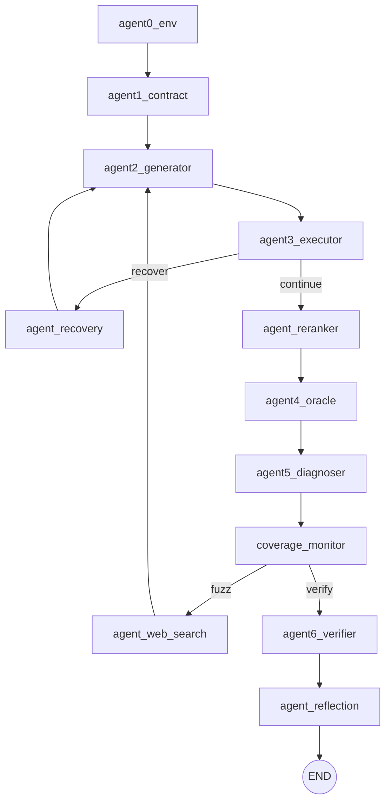
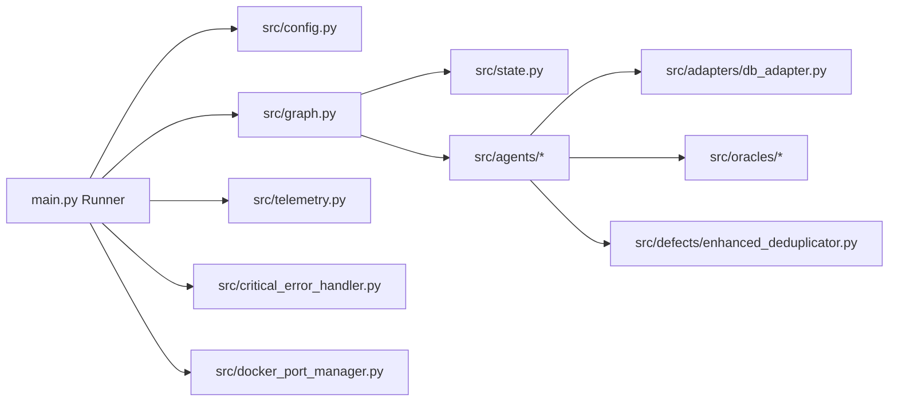

# 架构总览

## 项目定位

AI-DB-QC 是一套“LLM 多智能体 + 向量数据库适配层 + 可复现缺陷验证”的自动化质量检测流水线。它对目标向量数据库（Milvus/Qdrant/Weaviate）做以下闭环：

- 获取/缓存官方文档 → 提炼三层契约（L1/L2/L3）
- 生成测试用例（含对抗/负向）→ 执行前门控（L1 抽象合法性 + L2 运行就绪性）
- 预言机校验（传统 + 语义）→ 缺陷分类（Type-1..4）
- 可复现性验证与去重 → 输出标准化 GitHub Issue（Markdown）

## 顶层目录结构

```
/workspace
├── main.py                       # 主运行入口（Runner + RunGuard + Telemetry）
├── src/                          # 核心实现
│   ├── graph.py                  # LangGraph 工作流编排
│   ├── state.py                  # WorkflowState + 数据模型 + 状态持久化/压缩
│   ├── agents/                   # Agent0..6 + 辅助节点（rerank/recovery/web_search/reflection）
│   ├── adapters/                 # 向量数据库适配层（Milvus/Qdrant/Weaviate）
│   ├── defects/                  # 缺陷去重（增强版多维相似度）
│   ├── oracles/                  # 预言机/评分/校准
│   ├── parsers/                  # 文档爬取/清洗/解析
│   ├── alerting/                 # 告警
│   └── dashboard/                # Streamlit Dashboard
├── configs/                      # 数据库连接与 cross-db 任务配置（YAML）
├── docs/                         # 项目文档（架构/异常/优化/审计等）
├── issues/                       # 已生成的 Issue 样本（按数据库分类）
└── tests/                        # pytest（unit + integration）
```

## 工作流（LangGraph）与数据流

### 核心编排：StateGraph

工作流在 [build_workflow](file:///workspace/src/graph.py#L40-L103) 中构建，节点是“以 WorkflowState 为输入输出的函数”。



### 全局状态：WorkflowState

WorkflowState 定义了整条流水线的共享状态与关键控制信号（token budget、迭代次数、L2 门控状态、缺陷报告等），见 [WorkflowState](file:///workspace/src/state.py#L122-L178)。

关键字段（用于理解数据流的最小集合）：

- `target_db_input`：目标数据库及版本（用户输入/配置）
- `contracts`：三层契约（Agent1 输出，Agent2/3/4/5/6 消费）
- `current_test_cases`：待执行用例（Agent2 输出，Agent3 消费）
- `execution_results`：执行结果（Agent3 输出，Agent4/5 消费）
- `oracle_results`：预言机结果（Agent4 输出，Agent5/6 消费）
- `defect_reports` / `verified_defects`：缺陷报告与“可复现确认”列表（Agent5/6）
- `current_collection` / `data_inserted`：L2 就绪性门控信号（Agent3 依赖）
- `total_tokens_used` / `max_token_budget`：token 熔断（coverage_monitor 的 should_continue_fuzzing）

### Runner：main.py 的执行模型

[main.py](file:///workspace/main.py) 负责：

- 加载 YAML 与环境变量配置（ConfigLoader）
- RunGuard 强约束（仅允许特定目标/迭代，防止“降级/模拟路径”）
- 初始化：CriticalErrorHandler、DockerPortManager
- 编译 LangGraph 并用 `app.stream()` 逐节点流式执行，将每个节点的 `state_update` merge 回 `WorkflowState`（见 [main.py:L243-L318](file:///workspace/main.py#L243-L318)）
- 记录 Telemetry、性能快照、异常时生成 MRE + Root Cause Report（见 [main.py:L319-L406](file:///workspace/main.py#L319-L406)）

## 依赖关系（概念级）



## 设计要点（对维护者最重要的“为什么”）

- 以 `WorkflowState` 作为唯一共享事实源：让每个 agent 做“纯函数式状态更新”，便于复现与追踪。
- L1/L2 双层门控：让非法参数与环境未就绪分层计入缺陷类型，避免“把环境问题当成 DB bug”。
- verifier 的 fail-closed 安全策略：MRE 隔离执行默认不允许 host fallback（见 [agent6_verifier.py:L108-L115](file:///workspace/src/agents/agent6_verifier.py#L108-L115)），降低安全风险与误判。

